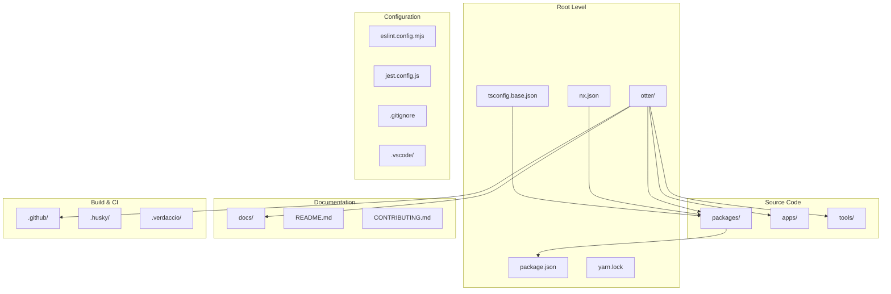
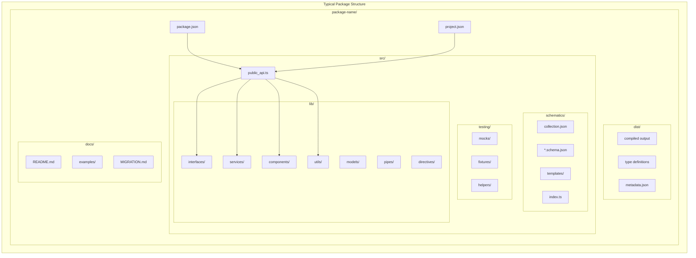
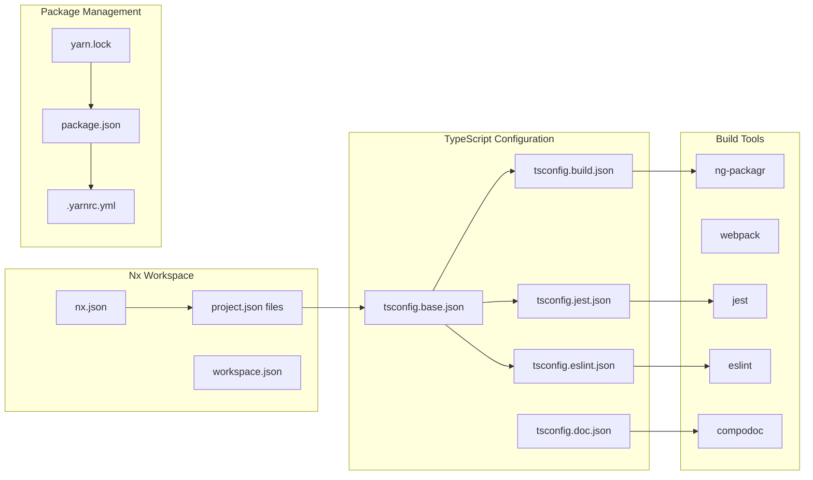
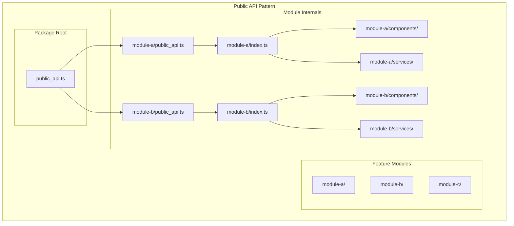
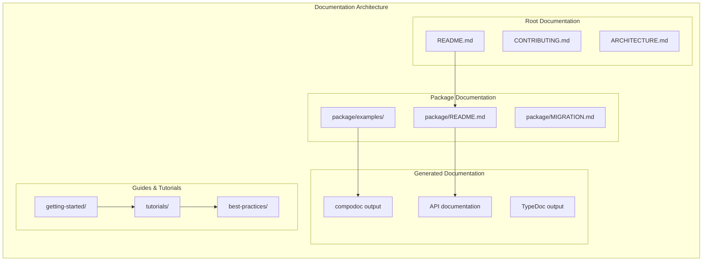

# Otter Framework - Codebase Structure Analysis

## Overview

This document provides a comprehensive analysis of the Otter Framework codebase structure, showing module dependencies, package organization, and architectural relationships through detailed Mermaid diagrams.

## 1. Monorepo Structure Overview



## 2. Package Organization Structure

```mermaid
graph LR
    subgraph "packages/"
        subgraph "@o3r Scope"
            O3R_CORE[@o3r/core]
            O3R_CONFIG[@o3r/configuration]
            O3R_COMPONENTS[@o3r/components]
            O3R_LOCALIZATION[@o3r/localization]
            O3R_RULES[@o3r/rules-engine]
            O3R_ANALYTICS[@o3r/analytics]
            O3R_TESTING[@o3r/testing]
            O3R_SCHEMATICS[@o3r/schematics]
            O3R_DESIGN[@o3r/design]
            O3R_FORMS[@o3r/forms]
            O3R_ROUTING[@o3r/routing]
            O3R_STYLING[@o3r/styling]
            O3R_EXTRACTORS[@o3r/extractors]
            O3R_WORKSPACE[@o3r/workspace]
            O3R_ESLINT[@o3r/eslint-plugin]
            O3R_MOBILE[@o3r/mobile]
            O3R_APIS[@o3r/apis-manager]
            O3R_DYNAMIC[@o3r/dynamic-content]
            O3R_LOGGER[@o3r/logger]
            O3R_TELEMETRY[@o3r/telemetry]
            O3R_THIRD_PARTY[@o3r/third-party]
            O3R_PIPELINE[@o3r/pipeline]
            O3R_APPLICATION[@o3r/application]
            O3R_STORE_SYNC[@o3r/store-sync]
            O3R_STYLE_DICT[@o3r/style-dictionary]
            O3R_STYLELINT[@o3r/stylelint-plugin]
            O3R_TEST_HELPERS[@o3r/test-helpers]
            O3R_ESLINT_CONFIG[@o3r/eslint-config]
            O3R_ARTIFACTORY[@o3r/artifactory-tools]
            O3R_AZURE[@o3r/azure-tools]
            O3R_NEW_VERSION[@o3r/new-version]
            O3R_CREATE[@o3r/create]
        end
        
        subgraph "@ama-sdk Scope"
            AMA_SDK_CORE[@ama-sdk/core]
            AMA_SDK_CLIENT[@ama-sdk/client-fetch]
            AMA_SDK_SPEC[@ama-sdk/spec]
            AMA_SDK_SCHEMATICS[@ama-sdk/schematics]
        end
        
        subgraph "@ama-styling Scope"
            AMA_STYLING_CORE[@ama-styling/core]
            AMA_STYLING_THEME[@ama-styling/theme]
            AMA_STYLING_TOKENS[@ama-styling/design-tokens]
        end
        
        subgraph "@ama-mfe Scope"
            AMA_MFE_CORE[@ama-mfe/core]
            AMA_MFE_SHELL[@ama-mfe/shell]
            AMA_MFE_REMOTE[@ama-mfe/remote]
            AMA_MFE_MESSAGES[@ama-mfe/messages]
            AMA_MFE_NG_UTILS[@ama-mfe/ng-utils]
        end
        
        subgraph "@ama-terasu Scope"
            AMA_TERASU_CLI[@ama-terasu/cli]
            AMA_TERASU_CORE[@ama-terasu/core]
        end
        
        subgraph "@o3r-training Scope"
            O3R_TRAINING_SDK[@o3r-training/sdk]
            O3R_TRAINING_TOOLS[@o3r-training/tools]
        end
    end
```

## 3. Core Dependencies Graph

```mermaid
graph TD
    subgraph "Foundation Layer"
        CORE[@o3r/core]
        LOGGER[@o3r/logger]
        TEST_HELPERS[@o3r/test-helpers]
        ESLINT_CONFIG[@o3r/eslint-config]
    end
    
    subgraph "Configuration Layer"
        CONFIG[@o3r/configuration]
        EXTRACTORS[@o3r/extractors]
        SCHEMATICS[@o3r/schematics]
    end
    
    subgraph "Component Layer"
        COMPONENTS[@o3r/components]
        DESIGN[@o3r/design]
        FORMS[@o3r/forms]
        STYLING[@o3r/styling]
        STYLE_DICT[@o3r/style-dictionary]
    end
    
    subgraph "Application Layer"
        ROUTING[@o3r/routing]
        LOCALIZATION[@o3r/localization]
        ANALYTICS[@o3r/analytics]
        MOBILE[@o3r/mobile]
        APPLICATION[@o3r/application]
    end
    
    subgraph "Business Logic Layer"
        RULES[@o3r/rules-engine]
        APIS[@o3r/apis-manager]
        DYNAMIC[@o3r/dynamic-content]
        STORE_SYNC[@o3r/store-sync]
    end
    
    subgraph "Development Tools Layer"
        TESTING[@o3r/testing]
        ESLINT_PLUGIN[@o3r/eslint-plugin]
        STYLELINT[@o3r/stylelint-plugin]
        WORKSPACE[@o3r/workspace]
        PIPELINE[@o3r/pipeline]
    end
    
    subgraph "External Integration Layer"
        TELEMETRY[@o3r/telemetry]
        THIRD_PARTY[@o3r/third-party]
        ARTIFACTORY[@o3r/artifactory-tools]
        AZURE[@o3r/azure-tools]
        NEW_VERSION[@o3r/new-version]
        CREATE[@o3r/create]
    end
    
    CORE --> CONFIG
    CORE --> COMPONENTS
    CORE --> ROUTING
    CORE --> RULES
    CORE --> SCHEMATICS
    
    CONFIG --> EXTRACTORS
    CONFIG --> RULES
    CONFIG --> DYNAMIC
    
    COMPONENTS --> DESIGN
    COMPONENTS --> FORMS
    COMPONENTS --> STYLING
    
    STYLING --> STYLE_DICT
    
    LOGGER --> ANALYTICS
    LOGGER --> TELEMETRY
    
    TEST_HELPERS --> TESTING
    
    ESLINT_CONFIG --> ESLINT_PLUGIN
    
    SCHEMATICS --> WORKSPACE
    WORKSPACE --> PIPELINE
```

## 4. Package Internal Structure



## 5. Build System Dependencies



## 6. Module Import/Export Structure



## 7. Testing Structure

```mermaid
graph TB
    subgraph "Testing Architecture"
        subgraph "Unit Tests"
            SPEC_FILES[*.spec.ts]
            TEST_HELPERS_PKG[@o3r/test-helpers]
            JEST_CONFIG[jest.config.js]
        end
        
        subgraph "Integration Tests"
            IT_TESTS[*.it.spec.ts]
            TESTING_PKG[@o3r/testing]
            FIXTURES_DIR[fixtures/]
        end
        
        subgraph "E2E Tests"
            E2E_TESTS[*.e2e-spec.ts]
            PLAYWRIGHT[playwright.config.ts]
            PAGE_OBJECTS[page-objects/]
        end
        
        subgraph "Test Utilities"
            MOCKS_DIR[mocks/]
            HELPERS_DIR[helpers/]
            SETUP_FILES[setup files]
        end
    end
    
    SPEC_FILES --> TEST_HELPERS_PKG
    IT_TESTS --> TESTING_PKG
    E2E_TESTS --> PLAYWRIGHT
    
    TEST_HELPERS_PKG --> MOCKS_DIR
    TESTING_PKG --> FIXTURES_DIR
    PLAYWRIGHT --> PAGE_OBJECTS
```

## 8. Documentation Structure



## Key Structural Patterns

### 1. Scoped Package Organization
- **@o3r**: Core framework packages
- **@ama-sdk**: SDK and API-related packages  
- **@ama-styling**: Styling and design system packages
- **@ama-mfe**: Micro-frontend packages
- **@ama-terasu**: CLI and tooling packages
- **@o3r-training**: Training and educational packages

### 2. Layered Architecture
- **Foundation**: Core utilities and base functionality
- **Configuration**: Metadata and configuration management
- **Component**: UI components and design system
- **Application**: Application-level features
- **Business Logic**: Rules engine and data management
- **Development Tools**: Build, test, and development utilities
- **External Integration**: Third-party integrations and tools

### 3. Nx Monorepo Structure
- Centralized configuration through `nx.json`
- Project-specific configuration via `project.json`
- Shared TypeScript configuration
- Dependency graph management
- Build caching and optimization

### 4. Consistent Package Structure
- Standard `src/` directory layout
- Public API exposure pattern
- Schematics for code generation
- Testing co-location
- Documentation standards

### 5. Build System Integration
- Nx workspace management
- Angular CLI integration
- TypeScript compilation
- Package bundling with ng-packagr
- Automated testing and linting

## Codebase Metrics

- **Total Packages**: 60+ packages across 6 scopes
- **Core Dependencies**: Angular 20+, TypeScript 5.9+, Nx 21+
- **Build System**: Nx workspace with Angular CLI
- **Testing**: Jest for unit tests, Playwright for E2E
- **Documentation**: Compodoc for API docs, custom guides
- **Code Quality**: ESLint, Prettier, Stylelint integration
