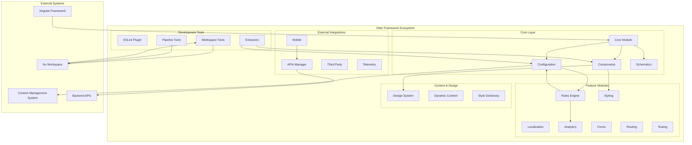
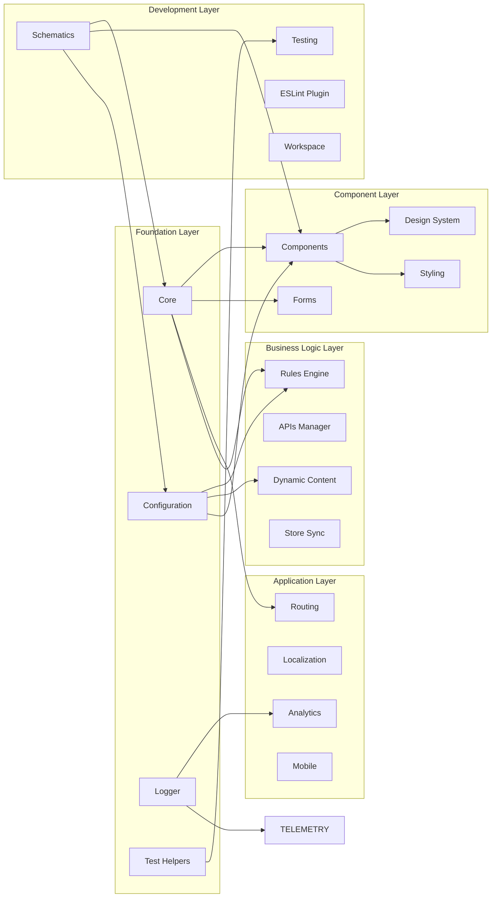
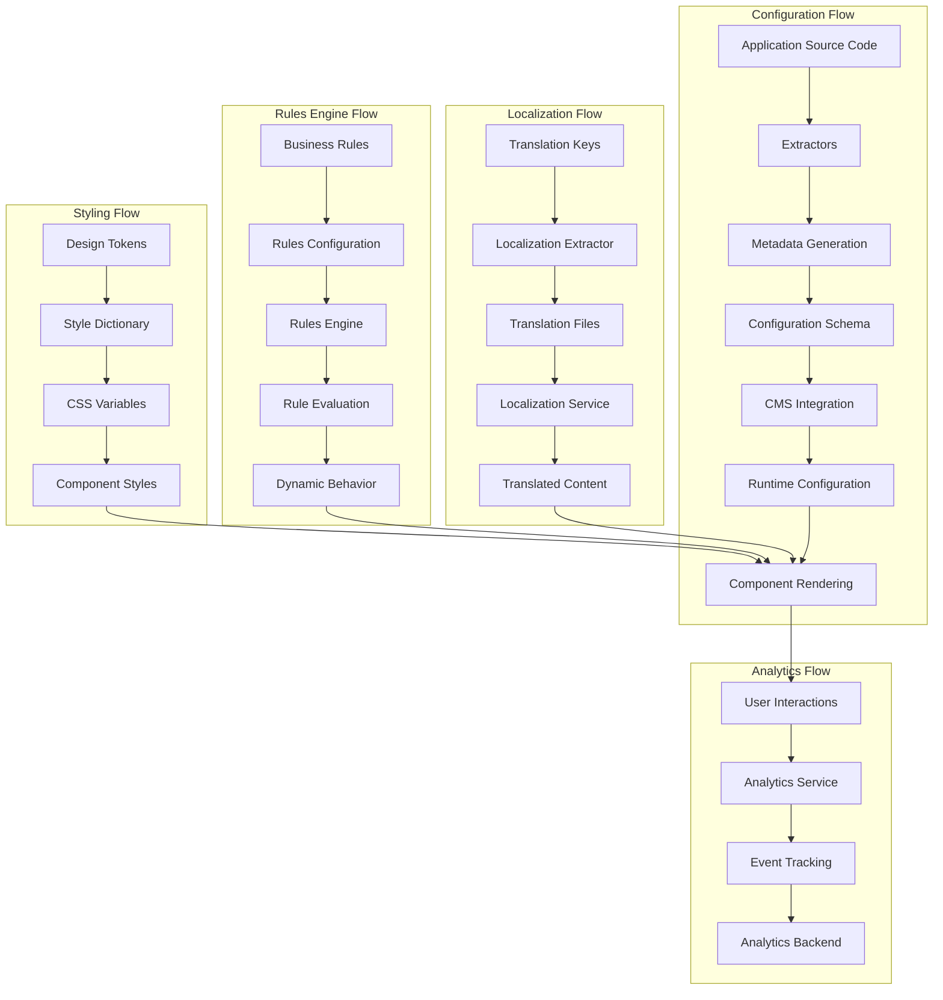
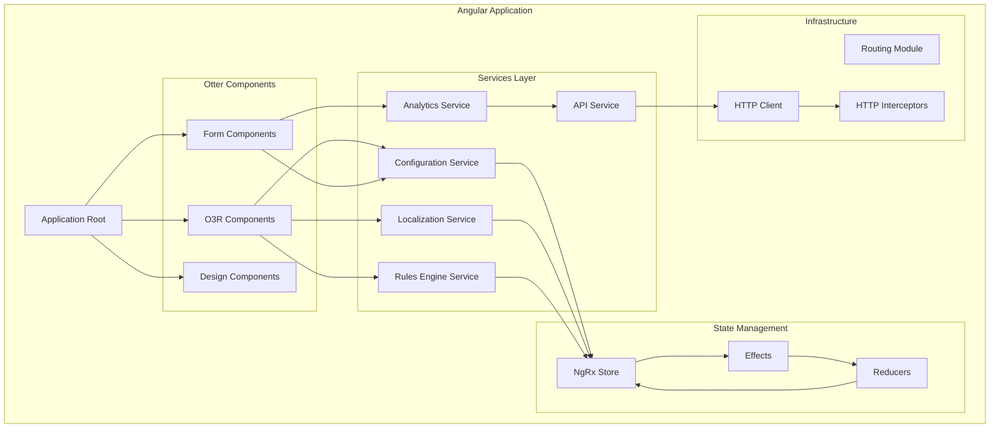

# Otter Framework - Logical Architecture

## Overview

The Otter Framework is a highly modular Angular framework designed to accelerate web application development. This document presents the logical architecture through multiple perspectives, showing system components, relationships, and data flow patterns.

## 1. High-Level System Architecture



## 2. Module Dependency Architecture



## 3. Data Flow Architecture



## 4. Component Interaction Architecture



## 5. Development Workflow Architecture

```mermaid
flowchart LR
    subgraph "Development Phase"
        A[Developer] --> B[Nx Workspace]
        B --> C[Schematics]
        C --> D[Code Generation]
        D --> E[Component Development]
        E --> F[Configuration Setup]
    end
    
    subgraph "Build Phase"
        F --> G[Extractors]
        G --> H[Metadata Extraction]
        H --> I[Build Process]
        I --> J[Bundle Generation]
    end
    
    subgraph "Testing Phase"
        J --> K[Unit Tests]
        K --> L[Integration Tests]
        L --> M[E2E Tests]
        M --> N[Quality Gates]
    end
    
    subgraph "Deployment Phase"
        N --> O[Pipeline Tools]
        O --> P[Deployment]
        P --> Q[Runtime Environment]
        Q --> R[CMS Integration]
    end
    
    subgraph "Runtime Phase"
        R --> S[Configuration Loading]
        S --> T[Application Bootstrap]
        T --> U[Component Initialization]
        U --> V[User Interaction]
    end
```



## 6. Multi-Package Architecture

```mermaid
graph TB
    subgraph "@o3r Packages"
        O3R_CORE[@o3r/core]
        O3R_CONFIG[@o3r/configuration]
        O3R_COMPONENTS[@o3r/components]
        O3R_LOCALIZATION[@o3r/localization]
        O3R_RULES[@o3r/rules-engine]
        O3R_ANALYTICS[@o3r/analytics]
        O3R_TESTING[@o3r/testing]
        O3R_SCHEMATICS[@o3r/schematics]
    end
    
    subgraph "@ama-sdk Packages"
        AMA_SDK_CORE[@ama-sdk/core]
        AMA_SDK_CLIENT[@ama-sdk/client]
        AMA_SDK_SPEC[@ama-sdk/spec]
    end
    
    subgraph "@ama-styling Packages"
        AMA_STYLE_CORE[@ama-styling/core]
        AMA_STYLE_THEME[@ama-styling/theme]
        AMA_STYLE_TOKENS[@ama-styling/design-tokens]
    end
    
    subgraph "@ama-mfe Packages"
        AMA_MFE_CORE[@ama-mfe/core]
        AMA_MFE_SHELL[@ama-mfe/shell]
        AMA_MFE_REMOTE[@ama-mfe/remote]
    end
    
    subgraph "@ama-terasu Packages"
        AMA_TERASU_CLI[@ama-terasu/cli]
        AMA_TERASU_CORE[@ama-terasu/core]
    end
    
    O3R_CORE --> O3R_CONFIG
    O3R_CORE --> O3R_COMPONENTS
    O3R_CONFIG --> O3R_RULES
    O3R_COMPONENTS --> O3R_LOCALIZATION
    
    AMA_SDK_CORE --> AMA_SDK_CLIENT
    AMA_SDK_SPEC --> AMA_SDK_CLIENT
    
    AMA_STYLE_TOKENS --> AMA_STYLE_THEME
    AMA_STYLE_CORE --> AMA_STYLE_THEME
    
    AMA_MFE_CORE --> AMA_MFE_SHELL
    AMA_MFE_CORE --> AMA_MFE_REMOTE
    
    O3R_CORE --> AMA_SDK_CORE
    O3R_COMPONENTS --> AMA_STYLE_CORE
    O3R_CORE --> AMA_MFE_CORE
```

## Architecture Principles

### 1. Modularity
- Each package serves a specific purpose and can be used independently
- Clear separation of concerns between different functional areas
- Minimal coupling between modules with well-defined interfaces

### 2. Configurability
- Metadata-driven configuration system
- Runtime configuration through CMS integration
- Extractable configuration from source code

### 3. Extensibility
- Plugin architecture for custom functionality
- Schematics for code generation and project setup
- Hook system for extending core functionality

### 4. Developer Experience
- Comprehensive tooling and workspace management
- Code generation through schematics
- Integrated testing and quality tools

### 5. Enterprise Ready
- Multi-package architecture for large-scale applications
- Micro-frontend support through @ama-mfe packages
- Analytics and telemetry for production monitoring

## Key Architectural Patterns

### 1. Metadata Extraction Pattern
The framework uses extractors to analyze source code and generate metadata, enabling dynamic configuration and CMS integration.

### 2. Configuration-Driven Components
Components are designed to be configurable through external configuration, allowing for dynamic behavior without code changes.

### 3. Rules Engine Pattern
Business logic is externalized through a rules engine, enabling non-technical users to modify application behavior.

### 4. Multi-Package Monorepo
The framework is organized as a monorepo with multiple npm packages, each serving specific functionality while maintaining consistency.

### 5. Plugin Architecture
Core functionality can be extended through plugins, providing flexibility for different use cases and requirements.
