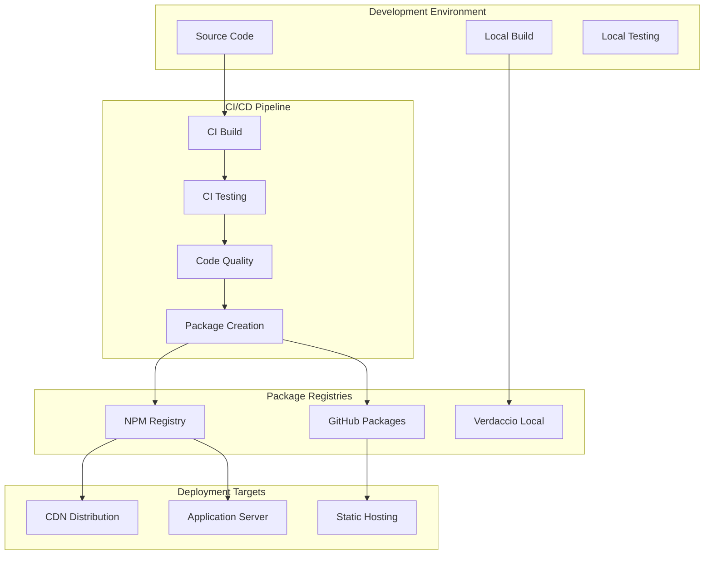
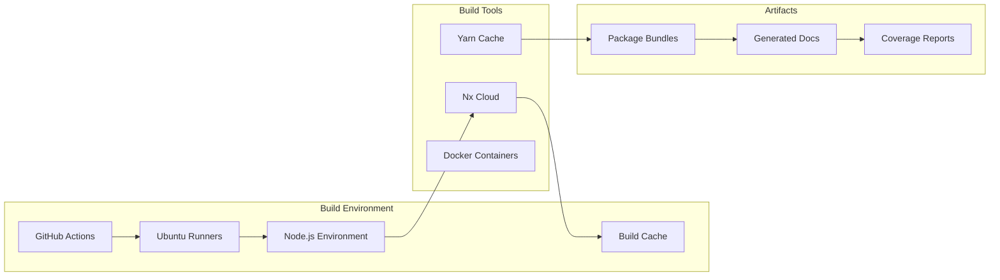
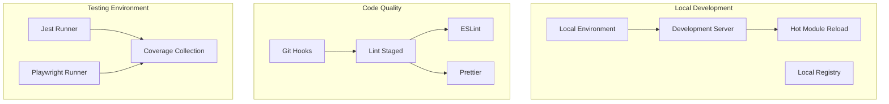
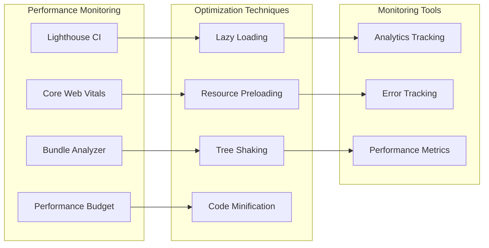
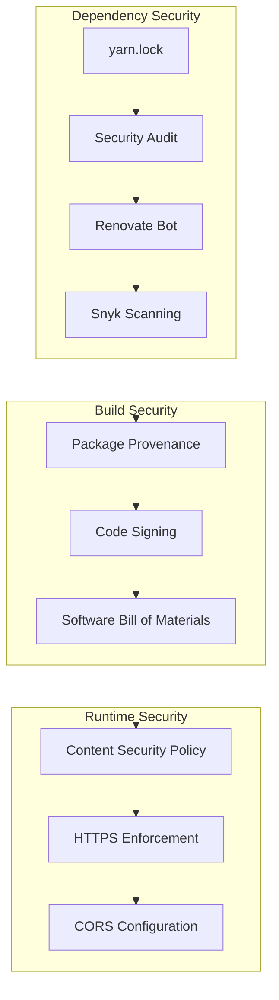
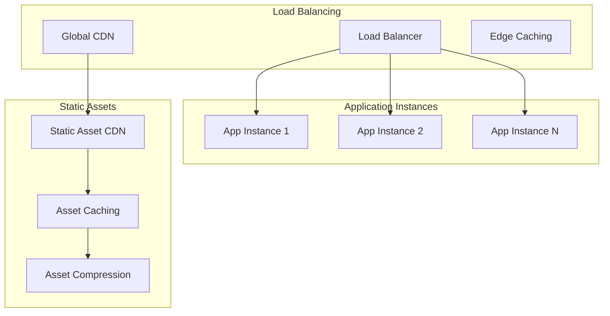
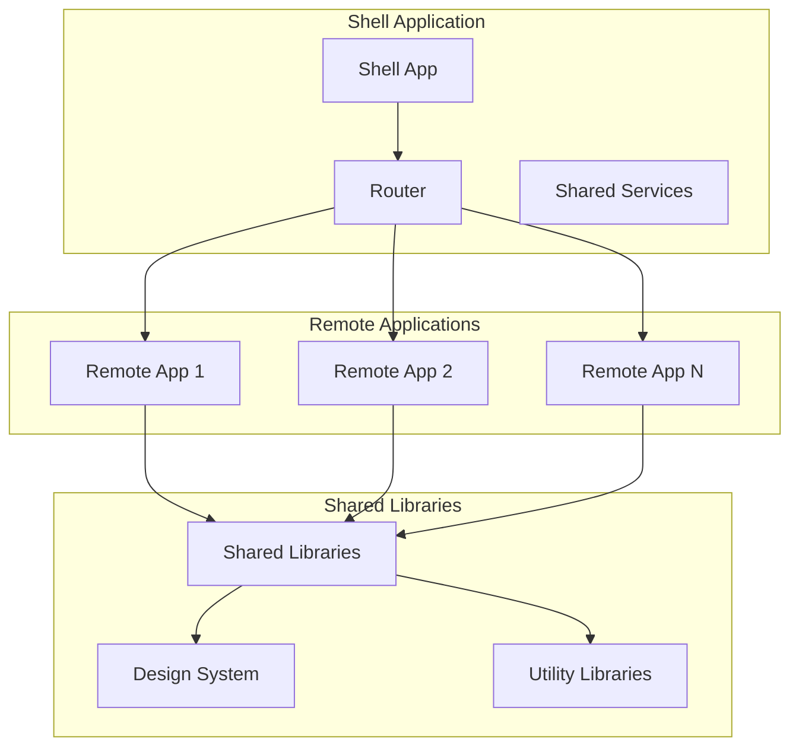
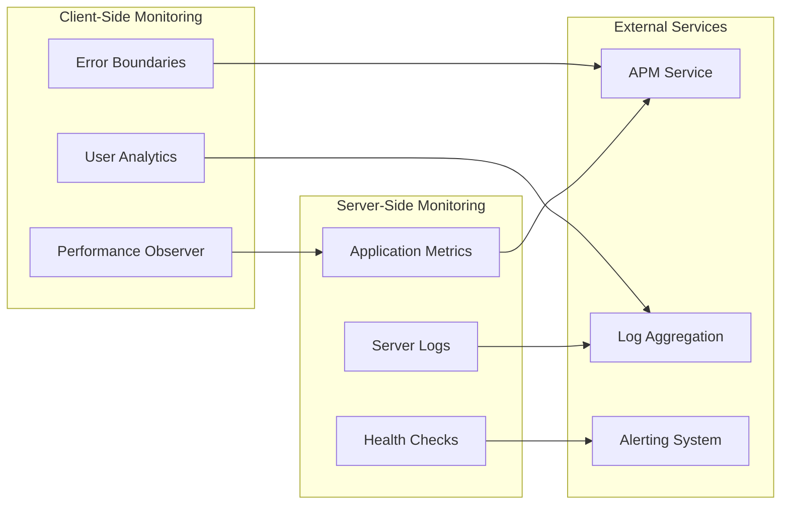

# Otter Framework - Technical Architecture

## Overview

This document details the technical architecture of the Otter Framework, including technology stack, deployment infrastructure, build systems, and operational considerations. This complements the logical architecture by focusing on implementation technologies and runtime environments.

## Technology Stack

### Core Framework Versions

| Technology | Version | Purpose |
|------------|---------|---------|
| Angular | ~20.2.0 | Primary frontend framework |
| TypeScript | ~5.9.2 | Primary development language |
| Node.js | ^20.19.0 \|\| ^22.17.0 \|\| ^24.0.0 | Runtime environment |
| Yarn | >=2.0.0 <5.0.0 | Package manager |
| Nx | ~21.5.0 | Monorepo management |
| RxJS | ^7.8.1 | Reactive programming |
| Zone.js | ~0.15.0 | Change detection |

### State Management

| Library | Version | Purpose |
|---------|---------|---------|
| @ngrx/store | ~20.0.0 | State management |
| @ngrx/effects | ~20.0.0 | Side effects management |
| @ngrx/entity | ~20.0.0 | Entity state management |
| @ngrx/router-store | ~20.0.0 | Router state integration |
| @ngrx/store-devtools | ~20.0.0 | Development tools |

### UI Framework & Components

| Library | Version | Purpose |
|---------|---------|---------|
| @angular/cdk | ~20.2.0 | Component development kit |
| @ng-bootstrap/ng-bootstrap | ^19.0.0 | Bootstrap components |
| @ng-select/ng-select | ~20.0.0 | Select components |
| Bootstrap | 5.3.7 | CSS framework |
| Sass | ~1.92.0 | CSS preprocessor |

### Testing Framework

| Library | Version | Purpose |
|---------|---------|---------|
| Jest | ~29.7.0 | Unit testing framework |
| @playwright/test | ~1.55.0 | E2E testing |
| jest-preset-angular | ~14.6.0 | Angular Jest integration |
| jest-environment-jsdom | ~29.7.0 | DOM testing environment |

### Build & Development Tools

| Tool | Version | Purpose |
|------|---------|---------|
| Webpack | ~5.101.0 | Module bundling |
| ng-packagr | ~20.3.0 | Angular library packaging |
| ESLint | ~9.35.0 | Code linting |
| Stylelint | ~16.24.0 | CSS linting |
| Compodoc | ^1.1.19 | Documentation generation |
| Husky | ~9.1.0 | Git hooks |

## Runtime Architecture

### Browser Support Matrix

| Browser | Minimum Version | ES Target |
|---------|----------------|-----------|
| Chrome | Latest - 2 | ES2022 |
| Firefox | Latest - 2 | ES2022 |
| Safari | Latest - 2 | ES2022 |
| Edge | Latest - 2 | ES2022 |

### JavaScript Runtime Configuration

```typescript
// TypeScript Compiler Options
{
  "target": "ES2022",
  "module": "ES2022", 
  "moduleResolution": "bundler",
  "lib": ["DOM", "DOM.Iterable", "ES2022"],
  "experimentalDecorators": true,
  "emitDecoratorMetadata": true,
  "strict": true,
  "allowSyntheticDefaultImports": true
}
```

### Bundle Configuration

- **Module Format**: ES2022 modules with bundler resolution
- **Tree Shaking**: Enabled for optimal bundle size
- **Code Splitting**: Lazy loading support for route-based chunks
- **Polyfills**: Minimal polyfills for ES2022 features
- **Source Maps**: Generated for development and debugging

## Deployment Architecture

### Package Distribution



### Infrastructure Components

#### 1. Build Infrastructure



#### 2. Development Infrastructure



### Container Architecture

```dockerfile
# Multi-stage build example
FROM node:20-alpine AS builder
WORKDIR /app
COPY package.json yarn.lock ./
RUN yarn install --frozen-lockfile
COPY . .
RUN yarn build

FROM nginx:alpine AS runtime
COPY --from=builder /app/dist /usr/share/nginx/html
COPY nginx.conf /etc/nginx/nginx.conf
EXPOSE 80
CMD ["nginx", "-g", "daemon off;"]
```

## Performance Architecture

### Bundle Optimization

| Optimization | Implementation | Impact |
|--------------|----------------|---------|
| Tree Shaking | ES modules + Webpack | 30-50% size reduction |
| Code Splitting | Route-based lazy loading | Improved initial load |
| Compression | Gzip/Brotli | 70-80% transfer reduction |
| Caching | Service Worker + HTTP cache | 90% repeat visit improvement |

### Runtime Performance



## Security Architecture

### Security Measures

| Layer | Implementation | Purpose |
|-------|----------------|---------|
| Package Security | npm audit, Snyk | Vulnerability scanning |
| Code Security | ESLint security rules | Static analysis |
| Build Security | Signed packages, provenance | Supply chain security |
| Runtime Security | CSP headers, HTTPS | Runtime protection |

### Dependency Management



## Scalability Architecture

### Horizontal Scaling



### Micro-Frontend Architecture



## Monitoring & Observability

### Application Monitoring



## Development Workflow

### CI/CD Pipeline

```yaml
# GitHub Actions Workflow
name: CI/CD Pipeline
on: [push, pull_request]

jobs:
  build:
    runs-on: ubuntu-latest
    steps:
      - uses: actions/checkout@v4
      - uses: actions/setup-node@v4
        with:
          node-version: '20'
          cache: 'yarn'
      - run: yarn install --frozen-lockfile
      - run: yarn build
      - run: yarn test
      - run: yarn lint
      - run: yarn e2e
      - uses: actions/upload-artifact@v4
        with:
          name: dist
          path: dist/
```

### Quality Gates

| Gate | Tool | Threshold |
|------|------|-----------|
| Unit Test Coverage | Jest | >80% |
| E2E Test Pass Rate | Playwright | 100% |
| Bundle Size | Bundle Analyzer | <2MB initial |
| Lighthouse Score | Lighthouse CI | >90 |
| Security Vulnerabilities | npm audit | 0 high/critical |

## Technology Roadmap

### Current State (2024)
- Angular 20.x
- TypeScript 5.9
- Nx 21.x
- Node.js 20+

### Planned Upgrades (2025)
- Angular 21.x (when available)
- TypeScript 5.10+
- Nx 22.x
- Enhanced micro-frontend support

### Long-term Vision
- Web Components integration
- Progressive Web App features
- Advanced caching strategies
- AI-powered development tools

## Operational Considerations

### Environment Configuration

| Environment | Purpose | Configuration |
|-------------|---------|---------------|
| Development | Local development | Hot reload, debug mode |
| Staging | Pre-production testing | Production-like, test data |
| Production | Live application | Optimized, monitoring enabled |

### Backup & Recovery

- **Source Code**: Git repositories with multiple remotes
- **Dependencies**: Package registry mirrors
- **Build Artifacts**: Artifact storage with retention policies
- **Documentation**: Automated generation and versioning

### Compliance & Governance

- **License Compliance**: Automated license scanning
- **Security Compliance**: Regular security audits
- **Performance Standards**: Automated performance testing
- **Code Quality**: Enforced through CI/CD pipeline
