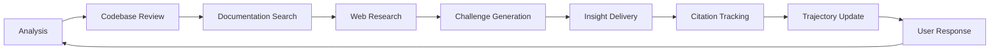
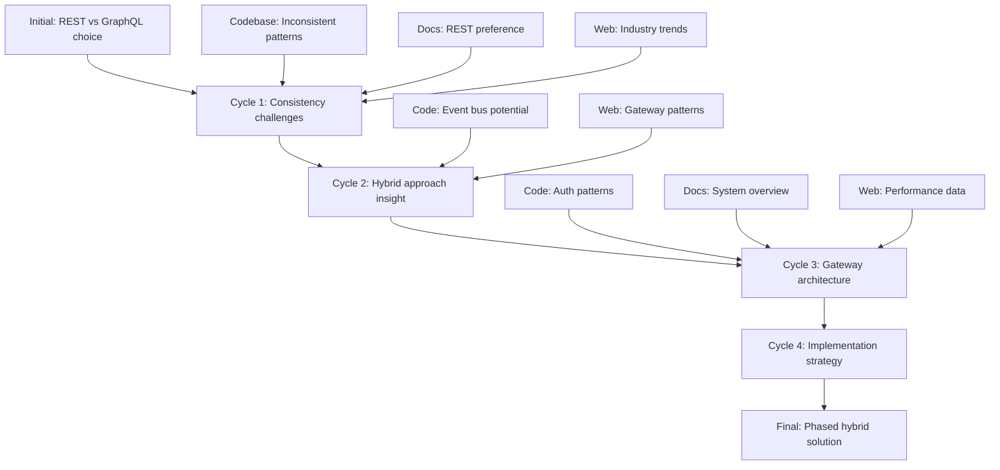

# Challenge Me Competency - User Guide

**Version**: 2.0 (Enhanced Multi-Source Research)  
**Last Updated**: 2025-10-15  
**Competency Path**: `olaf-core/prompts/researcher/challenge-me.md`

## Overview

The Challenge Me competency is an interactive ideation engine that challenges your ideas, provides insights, and tracks collaborative refinement through iterative cycles. The enhanced version now integrates multiple research sources including local codebases, documentation, and web resources to provide evidence-based challenges and insights.

## How It Works

```mermaid
flowchart TD
    A[User Request: "challenge me"] --> B[Parameter Collection]
    B --> C[Session Initialization]
    C --> D[Multi-Source Setup]
    D --> E[Iterative Cycles]
    E --> F{User Says Stop/Save?}
    F -->|No| G[Next Cycle]
    F -->|Yes| H[Generate Deliverables]
    
    D --> D1[Scan Codebase]
    D --> D2[Index Documentation]
    D --> D3[Prepare Web Search]
    
    G --> G1[Analyze Current Ideas]
    G --> G2[Research Codebase]
    G --> G3[Review Documentation]
    G --> G4[Web Research]
    G --> G5[Present Challenges]
    G --> G6[Generate Insights]
    G --> G7[Track Citations]
    G --> G8[Update Trajectory]
    G8 --> E
    
    H --> H1[think.md]
    H --> H2[path.md]
    H --> H3[sources.md]
```

## Getting Started

### Basic Usage
Simply type: `challenge me`

The system will prompt you for required parameters:

### Required Parameters
- **Subject**: The topic or subject area for ideation
- **Initial Thoughts**: Your starting ideas or description

### Optional Parameters
- **Codebase Path**: Path to local repository/codebase for analysis
- **Documentation Path**: Path to folder containing relevant documentation  
- **Web Search URLs**: Specific URLs for research or leave empty for general search
- **Research Depth**: shallow|moderate|deep (default: moderate)
- **Challenge Intensity**: gentle|moderate|rigorous (default: moderate)

### Example Session Start
```
User: challenge me
A
gent: I'll help you with an interactive ideation session. I need some information to get started:

**Subject**: What topic would you like to explore? (REQUIRED)
**Initial Thoughts**: What are your current ideas or thoughts on this topic? (REQUIRED)
**Codebase Path**: Do you have a local repository I should analyze? (Optional - provide path)
**Documentation Path**: Any documentation folder I should review? (Optional - provide path)
**Web Search URLs**: Specific URLs to research, or leave empty for general search (Optional)
**Research Depth**: How deep should I research? (shallow/moderate/deep - default: moderate)
**Challenge Intensity**: How aggressively should I challenge ideas? (gentle/moderate/rigorous - default: moderate)

User: 
Subject: API design patterns for microservices
Initial Thoughts: I'm thinking about using REST APIs with JSON, but wondering about GraphQL and event-driven patterns
Codebase Path: ./my-microservices-project
Documentation Path: ./docs/architecture
Web Search URLs: (leave empty for general search)
```

## Session Flow

### 1. Session Initialization
The system creates a unique session identifier and sets up multi-source research:

```
Session ID: api-design-patterns-20251015-1430
✓ Codebase scanned: ./my-microservices-project (15 services found)
✓ Documentation indexed: ./docs/architecture (8 documents)
✓ Web search strategy: General API design research
✓ Citation tracking initialized
```

### 2. Iterative Cycles

Each cycle follows this structure:



#### Cycle Example

**Cycle 1: Analysis Phase**
```
=== CYCLE 1 ===

ANALYSIS: Your current thinking focuses on REST vs GraphQL vs event-driven patterns. Let me examine your codebase and research to challenge this approach.

CODEBASE FINDINGS:
- Found 3 REST services using different authentication patterns
- Event bus implementation in /services/notification-service
- No GraphQL implementations detected
- Inconsistent error handling across services

DOCUMENTATION REVIEW:
- Architecture decision record favors REST for CRUD operations
- Event-driven pattern documented for async workflows
- No GraphQL evaluation found in decision records

WEB RESEARCH:
- Latest industry trends show hybrid approaches gaining traction
- Performance considerations for different patterns
- Team expertise requirements vary significantly

CHALLENGES:
1. Your codebase shows inconsistent REST implementations - how will you ensure consistency with new patterns?
2. You mention GraphQL but your team has no experience with it - what's your learning curve strategy?
3. Event-driven patterns are partially implemented - are you planning to complete this or start fresh?

INSIGHTS:
1. Consider API gateway pattern to unify different service patterns
2. Hybrid approach: REST for CRUD, events for async, GraphQL for complex queries
3. Your existing event bus could be leveraged rather than replaced

SOURCES CONSULTED:
- /services/auth-service/api/controllers/UserController.java
- /docs/architecture/ADR-001-api-patterns.md
- https://martinfowler.com/articles/microservices.html

What are your thoughts on these challenges? How do you see addressing the consistency issues in your current implementation?
```

### 3. User Response and Continuation
```
User: You're right about the consistency issues. I hadn't considered the hybrid approach. Can you explore how an API gateway would work with our current setup?

=== CYCLE 2 ===
[Next cycle begins with deeper analysis based on user response...]
```

## Multi-Source Research Integration

### Codebase Analysis
The system examines your code for:
- **Architecture patterns** and existing implementations
- **Code structure** and design decisions
- **Dependencies** and integration points
- **Comments and documentation** within code
- **Specific examples** to reference in challenges

### Documentation Review  
The system searches documentation for:
- **Decision records** and architectural choices
- **Best practices** and guidelines
- **Requirements** and constraints
- **Process documentation** and workflows
- **Related concepts** and specifications

### Web Research
The system conducts targeted research for:
- **Academic papers** and expert opinions
- **Industry best practices** and case studies
- **Current trends** and developments
- **Alternative approaches** and methodologies
- **Real-world examples** and implementations

## Output Files

When you say "save", the system generates three files in `olaf-data/findings/think-tank/<subject-3-words>-YYYYMMDD-HHMM/`:

### 1. think.md - Final Refined Ideas
Contains your final conclusions with source attribution:

```markdown
# API Design Patterns for Microservices - Final Design

**Session**: api-design-patterns-20251015-1430
**Date**: 2025-10-15 14:30 CEDT

## Final Refined Concept

### Hybrid API Strategy
Based on codebase analysis and research, implement a three-tier approach:
- REST APIs for CRUD operations (leveraging existing UserController patterns)
- Event-driven architecture for async workflows (extending current notification service)
- GraphQL gateway for complex query aggregation

### Architecture Decisions

#### 1. API Gateway Implementation
- Consolidate authentication patterns found in auth-service
- Route requests based on operation type
- Implement consistent error handling (addressing current inconsistencies)

[Source: /services/auth-service/api/controllers/UserController.java, ADR-001-api-patterns.md]

#### 2. Event-Driven Extensions
- Leverage existing event bus in notification-service
- Extend to order processing and inventory management
- Implement saga pattern for distributed transactions

[Source: /services/notification-service/EventBus.java, Richardson Microservices Patterns]
```

### 2. path.md - Evolution Trajectory
Documents how your thinking evolved through the session:

```markdown
# Ideation Trajectory - API Design Patterns

**Session**: api-design-patterns-20251015-1430
**Duration**: 5 cycles
**Evolution**: Single pattern focus → Hybrid multi-pattern strategy

## Initial State
**Subject**: API design patterns for microservices
**Starting Concept**: 
- REST vs GraphQL vs event-driven choice
- Single pattern selection approach
- Limited awareness of current codebase state

## Cycle 1: Reality Check
**Codebase Analysis**: Revealed inconsistent REST implementations
**Documentation Review**: Found existing ADR favoring REST for CRUD
**Challenges Presented**:
- Consistency issues in current implementation
- Team expertise gaps with GraphQL
- Partial event-driven implementation

**Key Insights**:
- Hybrid approach more practical than single pattern
- API gateway could unify different patterns
- Existing event bus underutilized

**Evolution**: Single pattern thinking → Multi-pattern strategy

## Cycle 2: Gateway Architecture Deep Dive
**Research Integration**: API gateway patterns and implementations
**Challenges Presented**:
- Gateway complexity vs. benefits
- Performance implications
- Team learning curve

**Key Refinements**:
- Phased implementation approach
- Leverage existing authentication patterns
- Start with routing, add features incrementally

**Evolution**: Theoretical gateway → Practical implementation plan
```

### 3. sources.md - Comprehensive Citations
NEW: Complete citation database organized by source type:

```markdown
# Research Sources - API Design Patterns Session

**Session**: api-design-patterns-20251015-1430
**Generated**: 2025-10-15 16:45 CEDT

## Codebase References

### Authentication Service
- **File**: `/services/auth-service/api/controllers/UserController.java`
- **Lines**: 45-67 (JWT token validation)
- **Relevance**: Existing authentication pattern for gateway integration
- **Cycles Used**: 1, 3, 4

### Notification Service  
- **File**: `/services/notification-service/EventBus.java`
- **Lines**: 12-89 (Event publishing mechanism)
- **Relevance**: Foundation for event-driven pattern extension
- **Cycles Used**: 1, 2, 5

### Order Service
- **File**: `/services/order-service/domain/OrderAggregate.java`
- **Lines**: 23-45 (Domain events)
- **Relevance**: Example of domain event implementation
- **Cycles Used**: 4, 5

## Documentation References

### Architecture Decision Records
- **Document**: `/docs/architecture/ADR-001-api-patterns.md`
- **Section**: "REST API Guidelines" (pages 2-4)
- **Relevance**: Existing architectural decisions and rationale
- **Cycles Used**: 1, 2, 3

### System Architecture
- **Document**: `/docs/architecture/system-overview.md`
- **Section**: "Service Communication Patterns" (page 7)
- **Relevance**: Current inter-service communication approach
- **Cycles Used**: 2, 4

## Web Resources

### Industry Best Practices
- **URL**: https://martinfowler.com/articles/microservices.html
- **Title**: "Microservices: a definition of this new architectural term"
- **Access Time**: 2025-10-15 14:52 CEDT
- **Key Excerpt**: "Smart endpoints and dumb pipes" principle
- **Relevance**: Foundational microservices communication principles
- **Cycles Used**: 1, 3

### API Gateway Patterns
- **URL**: https://microservices.io/patterns/apigateway.html
- **Title**: "API Gateway Pattern"
- **Access Time**: 2025-10-15 15:15 CEDT
- **Key Excerpt**: "Single entry point for all clients"
- **Relevance**: Gateway implementation guidance
- **Cycles Used**: 2, 3, 4

### Event-Driven Architecture
- **URL**: https://aws.amazon.com/event-driven-architecture/
- **Title**: "What is Event-Driven Architecture?"
- **Access Time**: 2025-10-15 15:33 CEDT
- **Key Excerpt**: "Loose coupling between producers and consumers"
- **Relevance**: Event pattern implementation strategies
- **Cycles Used**: 4, 5

## Cross-References

### Cycle 1 Sources
- Codebase: UserController.java, EventBus.java
- Documentation: ADR-001-api-patterns.md
- Web: Fowler microservices article

### Cycle 2 Sources  
- Codebase: EventBus.java (deeper analysis)
- Documentation: system-overview.md
- Web: API Gateway pattern, Kong documentation

### Cycle 3 Sources
- Codebase: All authentication services
- Documentation: ADR-001 (implementation details)
- Web: Gateway performance studies

[Additional cycles and sources...]

## Source Impact Analysis

### Most Influential Sources
1. **ADR-001-api-patterns.md**: Shaped understanding of existing decisions
2. **UserController.java**: Provided concrete authentication pattern
3. **Fowler microservices article**: Influenced hybrid approach thinking

### Research Gaps Identified
- No GraphQL evaluation in current documentation
- Limited performance testing data for current APIs
- Missing service mesh considerations

### Recommended Follow-up Research
- GraphQL vs REST performance comparison for your specific use cases
- Service mesh integration with API gateway patterns
- Team training resources for event-driven architecture
```

## Advanced Features

### Citation Tracking
Every insight and challenge is backed by specific sources:
- **Code references**: File paths, line numbers, specific functions
- **Documentation**: Document names, sections, page numbers  
- **Web resources**: Full URLs, titles, access timestamps

### Multi-Source Synthesis
The system combines findings from all sources to provide:
- **Evidence-based challenges** grounded in your actual codebase
- **Contextual insights** informed by your documentation
- **Industry-validated approaches** from web research

### Trajectory Visualization
Track how your ideas evolve through visual trajectory mapping:



## Best Practices

### Preparing for a Session
1. **Organize your codebase**: Ensure the path is accessible and well-structured
2. **Prepare documentation**: Have relevant docs in a single folder
3. **Define clear scope**: Be specific about what aspect you want to explore
4. **Set realistic expectations**: Complex topics may need multiple sessions

### During the Session
1. **Engage actively**: Respond thoughtfully to challenges
2. **Ask for clarification**: If sources seem unclear, ask for specifics
3. **Challenge back**: The system learns from your pushback
4. **Request deeper dives**: Ask to explore specific sources more thoroughly

### After the Session
1. **Review all three files**: Each provides different value
2. **Follow citation trails**: Explore referenced sources independently
3. **Plan implementation**: Use insights for concrete next steps
4. **Schedule follow-ups**: Complex topics benefit from multiple sessions

## Troubleshooting

### Common Issues

**"Codebase path not found"**
- Verify the path is correct and accessible
- Use relative paths from your current directory
- The system will continue without codebase analysis if needed

**"Too many sources overwhelming the discussion"**
- Request focus on specific source types
- Ask for prioritization of most relevant sources
- Use "shallow" research depth for simpler sessions

**"Citations seem incomplete"**
- The system maintains manual backups if tracking fails
- Request specific source verification during cycles
- Check sources.md for comprehensive citation database

**"Cycles becoming repetitive"**
- Ask for new research angles or unexplored sources
- Request deeper analysis of specific findings
- Consider switching to different documentation areas

### Getting Help
- Use "explain your reasoning" to understand source selection
- Ask "what sources are you consulting?" for transparency
- Request "show me the specific code/doc section" for verification

## Example Sessions

The competency has been used successfully for topics like:
- **API design patterns** (as shown above)
- **Database architecture decisions**
- **Testing strategy refinement**
- **Performance optimization approaches**
- **Security implementation patterns**

Each session produces comprehensive documentation with full source attribution, making the insights actionable and verifiable.

---

*This guide covers the enhanced Challenge Me competency. For basic usage without multi-source research, simply omit the optional codebase and documentation parameters.*