# Olaf Framework - Complete Detailed Design

**Version:** 4.0 Condensed Framework  
**Date:** 20251016-1200  
**Implementation:** Go-based olaf-init command with condensed framework architecture

## 1. Complete Directory Structure

### 1.1 User Data Installation Structure

```
%USERDATA%/
└── olaf/                                    # Main Olaf installation
    ├── base/                                # Base layer between olaf and components
    │   ├── olaf-core/                       # → Symlink to actual olaf installation
    │   │   ├── reference/                   # 🔥 IMPORTANT FILES LOCATION
    │   │   │   ├── .condensed/
    │   │   │   │   └── olaf-framework-condensed.md  # 🔥 SINGLE self-sufficient framework file
    │   │   │   ├── core-principles.md       # 🔥 Core behavioral rules
    │   │   │   ├── memory-map.md            # 🔥 Memory map template
    │   │   │   ├── team-delegation.md       # 🔥 Delegation protocols
    │   │   │   ├── competencies/            # 🔥 COMPETENCY HIERARCHY
    │   │   │   │   ├── kernel-competencies.md    # 🔒 PROTECTED - Core system competencies
    │   │   │   │   ├── regular-competencies.md   # 📋 Standard competencies
    │   │   │   │   └── extended-competencies.md  # 🚀 Advanced competencies
    │   │   │   └── query-competency-index.md # 🔥 Master competency index
    │   │   ├── prompts/                     # Individual prompt files
    │   │   ├── templates/                   # Framework templates
    │   │   └── tools/
    │   │       └── olaf-init                # Go binary for initialization
    │   ├── olaf-data-user/                  # User-specific data (travels with user)
    │   │   ├── findings/                    # User's code review history
    │   │   ├── carry-overs/                 # User's personal tasks
    │   │   └── templates/                   # User's personal templates
    │   ├── olaf-data-common/                # Common data serving other folders
    │   │   ├── projects/                    # Common project templates
    │   │   ├── products/                    # Common product templates
    │   │   └── templates/                   # Shared templates
    │   └── cache/                           # Temporary files and indexes (under base)
    │       ├── condensed-frameworks/        # User-specific cached frameworks
    │       │   ├── developer-java-finance.md
    │       │   ├── analyst-finance.md
    │       │   └── manager-all.md
    │       ├── memory-maps/                 # Computed memory maps
    │       │   └── computed-memory-map.json
    │       └── metadata/                    # Cache metadata
    │           ├── cache-index.json         # Cache validity tracking
    │           └── specifics-hash.json      # Hash of available specifics
    └── specifics/                           # Domain-specific competency repositories
        ├── vba-competencies/                # 🔗 Cloned external git repo
        │   ├── .git/                        # Git repository metadata
        │   └── olaf-core/
        │       ├── reference/
        │       │   ├── competencies/        # 📋 DOMAIN COMPETENCY HIERARCHY (NO KERNEL)
        │       │   │   ├── regular-competencies.md   # 📋 VBA standard competencies
        │       │   │   └── extended-competencies.md  # 🚀 VBA advanced competencies
        │       │   └── query-competency-index.md     # Domain competency index
        │       ├── prompts/                 # Domain-specific prompts
        │       │   ├── vba-developer/
        │       │   ├── vba-analyst/
        │       │   └── vba-automation/
        │       ├── templates/               # Domain-specific templates
        │       │   └── vba-project/
        │       └── tools/                   # Domain-specific tools
        │           └── vba-helper
        ├── finance-competencies/            # 🔗 Cloned external git repo
        │   ├── .git/                        # Git repository metadata
        │   └── olaf-core/
        │       ├── reference/
        │       │   ├── competencies/        # 📋 DOMAIN COMPETENCY HIERARCHY (NO KERNEL)
        │       │   │   ├── regular-competencies.md   # 📋 Finance standard competencies
        │       │   │   └── extended-competencies.md  # 🚀 Finance advanced competencies
        │       │   └── query-competency-index.md     # Domain competency index
        │       ├── prompts/                 # Domain-specific prompts
        │       │   ├── finance-analyst/
        │       │   ├── finance-controller/
        │       │   └── finance-auditor/
        │       ├── templates/               # Domain-specific templates
        │       │   └── finance-project/
        │       └── tools/                   # Domain-specific tools
        │           └── finance-calculator
        └── automation-competencies/         # 🔗 Cloned external git repo
            ├── .git/                        # Git repository metadata
            └── olaf-core/
                ├── reference/
                │   ├── competencies/        # 📋 DOMAIN COMPETENCY HIERARCHY (NO KERNEL)
                │   │   ├── regular-competencies.md   # 📋 Automation standard competencies
                │   │   └── extended-competencies.md  # 🚀 Automation advanced competencies
                │   └── query-competency-index.md     # Domain competency index
                ├── prompts/                 # Domain-specific prompts
                │   ├── automation-engineer/
                │   ├── devops-specialist/
                │   └── ci-cd-expert/
                ├── templates/               # Domain-specific templates
                │   └── automation-project/
                └── tools/                   # Domain-specific tools
                    └── automation-helper
```

### 1.2 Actual Olaf Installation Location

```
%PROGRAMDATA%/olaf/                          # Actual framework installation (read-only)
├── olaf-core/                               # Core framework files
│   ├── reference/                           # 🔥 IMPORTANT FILES LOCATION
│   │   ├── .condensed/
│   │   │   └── olaf-framework-condensed.md  # 🔥 MASTER condensed framework (self-sufficient)
│   │   ├── core-principles.md               # 🔥 Core behavioral rules
│   │   ├── memory-map.md                    # 🔥 Memory map template
│   │   ├── team-delegation.md               # 🔥 Delegation protocols
│   │   ├── competencies/                    # 🔥 COMPETENCY HIERARCHY
│   │   │   ├── kernel-competencies.md       # 🔒 PROTECTED - Core system competencies (NEVER filtered)
│   │   │   ├── regular-competencies.md      # 📋 Standard competencies (user-filterable)
│   │   │   └── extended-competencies.md     # 🚀 Advanced competencies (user-filterable)
│   │   └── query-competency-index.md        # 🔥 Master competency index (references all levels)
│   ├── prompts/                             # Individual prompt files (for development)
│   │   ├── project-manager/
│   │   ├── developer/
│   │   └── prompt-engineer/
│   ├── templates/                           # Framework templates
│   │   └── .gitkeep
│   └── tools/
│       └── olaf-init                        # Go binary for initialization
├── olaf-data-common/                        # Common data templates
│   ├── projects/                            # Common project templates
│   ├── products/                            # Common product templates
│   └── templates/                           # Shared templates
├── olaf-data-user/                          # User-specific data template structure
│   ├── findings/                            # User's code review history template
│   │   └── .gitkeep
│   ├── carry-overs/                         # User's personal tasks template
│   │   └── .gitkeep
│   └── templates/                           # User's personal templates
│       └── .gitkeep
├── AGENTS.md                                # Framework agent instructions template
└── version.txt                              # Framework version
```

### 1.3 Project Structure After olaf-init

```
project-repository/
├── .github/
│   └── copilot-instructions.md              # GitHub Copilot entry point
├── .windsurf/
│   └── rules.md                             # Windsurf agent rules (if applicable)
├── .kiro/
│   └── steering/
│       └── olaf-bootstrap.md                # Kiro steering doc (if applicable)
├── AGENTS.md                                # Project agent instructions
├── olaf-core/                               # → Symlink to %USERDATA%/olaf/base/olaf-core/
│   └── reference/                           # 🔥 IMPORTANT FILES (via symlink)
│       ├── .condensed/
│       │   └── olaf-framework-condensed.md  # 🔥 SINGLE framework file (via symlink)
│       ├── core-principles.md               # 🔥 Core behavioral rules (via symlink)
│       ├── memory-map.md                    # 🔥 Memory map template (via symlink)
│       ├── team-delegation.md               # 🔥 Delegation protocols (via symlink)
│       ├── competencies/                    # 🔥 COMPETENCY HIERARCHY (via symlink)
│       │   ├── kernel-competencies.md       # 🔒 PROTECTED - Always included
│       │   ├── regular-competencies.md      # 📋 Standard - User filterable
│       │   └── extended-competencies.md     # 🚀 Advanced - User filterable
│       └── query-competency-index.md        # 🔥 Master competency index (via symlink)
├── olaf-data-user/                          # → Symlink to %USERDATA%/olaf/base/olaf-data-user/
│   ├── findings/                            # User's code review history (via symlink)
│   ├── carry-overs/                         # User's personal tasks (via symlink)
│   └── templates/                           # User's personal templates (via symlink)
├── specifics/                               # → Symlink to %USERDATA%/olaf/specifics/
│   ├── vba-competencies/                    # 🔗 Domain-specific git repo (via symlink)
│   │   └── olaf-core/
│   │       ├── reference/
│   │       │   └── query-competency-index.md
│   │       ├── prompts/                     # Domain-specific prompts (via symlink)
│   │       ├── templates/                   # Domain-specific templates (via symlink)
│   │       └── tools/                       # Domain-specific tools (via symlink)
│   ├── finance-competencies/                # 🔗 Domain-specific git repo (via symlink)
│   │   └── olaf-core/
│   │       ├── reference/
│   │       │   └── query-competency-index.md
│   │       ├── prompts/                     # Domain-specific prompts (via symlink)
│   │       ├── templates/                   # Domain-specific templates (via symlink)
│   │       └── tools/                       # Domain-specific tools (via symlink)
│   └── automation-competencies/             # 🔗 Domain-specific git repo (via symlink)
│       └── olaf-core/
│           ├── reference/
│           │   └── query-competency-index.md
│           ├── prompts/                     # Domain-specific prompts (via symlink)
│           ├── templates/                   # Domain-specific templates (via symlink)
│           └── tools/                       # Domain-specific tools (via symlink)
└── olaf-data/                               # Project-specific data
    ├── peoples/                             # Project team members
    │   └── .gitkeep
    ├── projects/                            # Project tracking
    │   └── .gitkeep
    ├── decisions/                           # Project decisions
    │   └── .gitkeep
    └── conversations/                       # Project conversations
        └── .gitkeep
```

## 2. Symlink Architecture

### 2.1 Installation Symlinks


### 2.2 Project Symlinks


## 3. Detailed Installation Process

### 3.1 Olaf OSS Installation

```mermaid
sequenceParam
    participant User
    participant Installer
    participant System
    
    User->>Installer: Run Olaf installer
    Installer->>System: Create %PROGRAMDATA%/olaf/
    Installer->>System: Copy framework files to olaf/
    Installer->>System: Create %USERDATA%/olaf/
    Installer->>System: Create %USERDATA%/olaf/base/ layer
    Installer->>System: Create symlink: base/olaf-core → %PROGRAMDATA%/olaf/olaf-core
    Installer->>System: Create olaf/olaf-data-user/ structure
    Installer->>System: Create symlink: base/olaf-data-user → olaf/olaf-data-user
    Installer->>System: Create olaf/specifics/ directory
    Installer->>System: Add olaf/tools/ to PATH
    Installer->>User: ✅ Installation complete
```

### 3.2 Project Initialization Process

```mermaid
flowchart TD
    START([User runs: olaf-init --role=developer --domains=java,finance]) --> DETECT[Detect project type + Parse user parameters]
    DETECT --> SYMCORE[Create olaf-core/ symlink to %USERDATA%/olaf/base/olaf-core/]
    SYMCORE --> SYMUSER[Create olaf-data-user/ symlink to %USERDATA%/olaf/base/olaf-data-user/]
    SYMUSER --> SYMSPEC[Create specifics/ symlink to %USERDATA%/olaf/specifics/]
    SYMSPEC --> USERCLONE[User manually clones/copies domain-specific repos to %USERDATA%/olaf/specifics/]
    USERCLONE --> PROJDATA[Create olaf-data/ from templates]
    PROJDATA --> CHECKCACHE{Cached condensed framework exists?}
    CHECKCACHE -->|Yes| USECACHE[Use cached condensed framework]
    CHECKCACHE -->|No| MEMMAP[Compute memory map from project structure]
    MEMMAP --> COMPUTE[Compute merged competency index based on user role + domains]
    COMPUTE --> CONDENSE[Generate condensed framework in cache]
    CONDENSE --> CACHE[Store computed memory map and framework in cache]
    USECACHE --> CACHE
    CACHE --> AGENTS[Create project AGENTS.md]
    AGENTS --> COPILOT[Create .github/copilot-instructions.md]
    COPILOT --> WINDSURF{Windsurf detected?}
    WINDSURF -->|Yes| WINDRULES[Create .windsurf/rules.md]
    WINDSURF -->|No| KIRO{Kiro detected?}
    WINDRULES --> COMPLETE
    KIRO -->|Yes| KIRODOC[Create .kiro/steering/olaf-bootstrap.md]
    KIRO -->|No| COMPLETE
    KIRODOC --> COMPLETE[✅ Project initialized]
    
    style START fill:#ff9ff3
    style COMPLETE fill:#54a0ff
```



## 4. Condensed Framework Architecture

### 4.1 Single Framework Philosophy

**CRITICAL CHANGE**: The new architecture uses a single, self-sufficient condensed framework file that contains ALL necessary components:
- Memory map with project structure and file ID mappings
- Core principles with behavioral rules  
- Competency patterns with task mappings
- Interaction protocols
- General role and behavior guidelines

### 4.2 Hierarchical Framework Merging Process


**Merging Rules:**
1. **🔒 Kernel**: Always included first (protected)
2. **📋 Regular**: Base + Domain regular competencies (filtered by user)
3. **🚀 Extended**: Base + Domain extended competencies (filtered by user + role level)

### 4.3 Framework Components (All Self-Contained)

Each condensed framework contains:
- `<olaf-session-initialization>` - Bootstrap instructions
- `<olaf-protocol-hierarchy>` - Execution protocols  
- `<olaf-interaction-protocols>` - Act/Propose-Act/Propose-Confirm-Act
- `<olaf-core-principles>` - Behavioral rules
- `<olaf-general-role-and-behavior>` - Expert domain approach
- `## Competency Patterns→Workflow|Protocol` - Task mappings
- `<olaf-framework-validation>` - Self-sufficiency validation

## 5. Memory Map Dynamic Resolution

### 5.1 Computed Memory Map (Generated by olaf-init)

The memory map is computed by `olaf-init` based on the actual project structure and stored in cache:

```markdown
## Memory Map (Computed and Cached by olaf-init)
- core_dir=my-repo/, ack_dir=olaf-core/, ads_dir=olaf-data/
- prompts_dir=[ack_dir]prompts/, tools_dir=[ack_dir]tools/
- templates_dir=[ack_dir]templates/, questionnaires_dir=[ack_dir]questionnaires/
- reference_dir=[ack_dir]reference/, condensed_dir=[reference_dir].condensed/
- condensed_framework=[condensed_dir]olaf-framework-condensed.md
- peoples_dir=[ads_dir]peoples/, projects_dir=[ads_dir]projects/
- changelog_register=[projects_dir]changelog-register.md
- jobs=[projects_dir]jobs-register.md, jobs_dir=[projects_dir]Jobs/
- product_dir=[ads_dir]product/, decision_records_dir=[product_dir]decision-records/
- findings_dir=[ads_dir]findings/, code_reviews_dir=[findings_dir]code-reviews/
- practices_dir=[ads_dir]practices/
- handover=[ads_dir]handover-conversation.md

# Domain-specific paths (computed from available specifics)
- vba_prompts=[ack_dir]../specifics/vba-competencies/olaf-core/prompts/
- finance_tools=[ack_dir]../specifics/finance-competencies/olaf-core/tools/
- automation_templates=[ack_dir]../specifics/automation-competencies/olaf-core/templates/
```

**Key Changes**: 
- Memory map computed dynamically by `olaf-init` based on project structure
- Stored in `base/cache/computed-memory-map.json`
- Embedded in final condensed framework
- Includes paths to available domain-specific resources

## 6. Agent Bootstrap Process

### 6.1 Simplified Bootstrap Sequence

```mermaid
sequenceParam
    participant Agent as AI Agent
    participant Entry as Entry Point
    participant Framework as olaf-framework-condensed.md
    
    Agent->>Entry: Start session
    Entry->>Framework: Load SINGLE condensed framework file
    Framework->>Agent: ✅ Complete Olaf context loaded (self-sufficient)
    
    Note over Framework: Contains ALL components: memory map, competencies, protocols, principles
    Note over Entry: Entry points: .github/copilot-instructions.md, AGENTS.md, .windsurf/rules.md, .kiro/steering/olaf-bootstrap.md
```

### 6.2 Entry Point Files

**GitHub Copilot (.github/copilot-instructions.md):**
```markdown
# Copilot Instructions

## CRITICAL: Olaf Framework Bootstrap
At session start, IMMEDIATELY read: `olaf-core/reference/.condensed/olaf-framework-condensed.md`
This single file contains the complete, self-sufficient Olaf framework.
```

**Windsurf (.windsurf/rules.md):**
```markdown
# Windsurf Rules

## Framework Initialization
- Read: `olaf-core/reference/.condensed/olaf-framework-condensed.md` at session start
- This file is completely self-sufficient - no additional files needed
```

**Kiro (.kiro/steering/olaf-bootstrap.md):**
```markdown
# OLAF Framework - Kiro Bootstrap

**CRITICAL: ALWAYS LOAD FIRST**

Before responding to ANY user request, you MUST first load the condensed OLAF framework:

#[[file:olaf-core/reference/.condensed/olaf-framework-condensed.md]]

**DO NOT proceed with any task until the condensed framework is loaded.**
```

**AGENTS.md:**
```markdown
# AGENTS.md

## Framework Bootstrap
MANDATORY: Read `olaf-core/reference/.condensed/olaf-framework-condensed.md` before any task execution.
This single file contains everything needed - it is completely self-sufficient.
```

## 7. Go Implementation Design

### 7.1 Project Structure

```
olaf-init/
├── cmd/
│   └── olaf-init/
│       └── main.go                          # CLI entry point
├── internal/
│   ├── config/
│   │   ├── config.go                        # Configuration management
│   │   └── paths.go                         # Path resolution
│   ├── detector/
│   │   └── project.go                       # Project type detection
│   ├── symlink/
│   │   ├── manager.go                       # Symlink creation/management
│   │   └── windows.go                       # Windows-specific symlink handling
│   ├── repo/
│   │   ├── cloner.go                        # Git repository cloning
│   │   └── manager.go                       # Repository management
│   ├── competency/
│   │   ├── merger.go                        # Competency index merging
│   │   ├── parser.go                        # Competency file parsing
│   │   └── types.go                         # Competency data structures
│   ├── template/
│   │   ├── generator.go                     # Template file generation
│   │   └── embedded.go                      # Embedded template files
│   └── bootstrap/
│       ├── agents.go                        # AGENTS.md generation
│       ├── copilot.go                       # Copilot instructions generation
│       ├── windsurf.go                      # Windsurf rules generation
│       └── kiro.go                          # Kiro steering doc generation
├── pkg/
│   ├── filesystem/
│   │   └── utils.go                         # File system utilities
│   └── git/
│       └── client.go                        # Git client wrapper
├── testdata/                                # Test fixtures
├── go.mod
├── go.sum
├── Makefile
└── README.md
```

### 7.2 Core Go Interfaces (Updated for Condensed Architecture)

```go
// internal/config/config.go
type Config struct {
    UserDataPath    string
    OlafOSSPath     string
    ProjectPath     string
    ProjectType     ProjectType
    UserRole        UserRole        // developer, analyst, manager, etc.
    UserDomains     []string        // java, finance, vba, automation, etc.
    SpecificRepos   []SpecificRepo
    UseCache        bool            // Use cached condensed framework if available
}

// internal/detector/project.go
type ProjectDetector interface {
    DetectType(projectPath string) (ProjectType, error)  // Analyze files: pom.xml->Java, .vba->VBA, etc.
    SuggestRepos(projectType ProjectType, userRole UserRole, userDomains []string) []SpecificRepo // Suggest based on project + user preferences
    FilterCompetencies(competencies []Competency, userRole UserRole, userDomains []string) []Competency // Filter competencies by user role/domains
}

// internal/symlink/manager.go
type SymlinkManager interface {
    CreateSymlink(target, link string) error
    VerifySymlink(link string) (bool, error)
    RepairSymlink(target, link string) error
}

// internal/framework/merger.go - UPDATED for condensed architecture
type FrameworkMerger interface {
    LoadCondensedFrameworks(sources []FrameworkSource) error
    MergeFrameworks() (*CondensedFramework, error)
    GenerateFinalFramework() (string, error)
}

// internal/cache/manager.go - NEW for cache management
type CacheManager interface {
    HasValidCache(config Config) bool                    // Check if cached framework exists and is valid
    LoadCachedFramework(config Config) (*CondensedFramework, error) // Load from cache
    SaveFrameworkToCache(framework *CondensedFramework, config Config) error // Save to cache
    InvalidateCache(config Config) error                 // Clear cache when specifics change
}

// internal/framework/types.go - NEW for condensed architecture
type CondensedFramework struct {
    SessionInit      string
    Protocols        string
    CorePrinciples   string
    MemoryMap        string
    Competencies     map[string]CompetencyPattern
    RoleBehavior     string
    Validation       string
}

// Competency hierarchy types
type CompetencyLevel int
const (
    CompetencyLevelKernel CompetencyLevel = iota    // 🔒 Protected, always included
    CompetencyLevelRegular                          // 📋 Standard, user-filterable
    CompetencyLevelExtended                         // 🚀 Advanced, user-filterable
)

type CompetencyPattern struct {
    ID          string
    Pattern     string
    Workflow    string
    Protocol    string
    Level       CompetencyLevel
    Domain      string
    Roles       []UserRole
}

// internal/bootstrap/agents.go
type AgentBootstrapper interface {
    GenerateAgentsFile(config Config) error
    GenerateCopilotInstructions(config Config) error
    GenerateWindsurfRules(config Config) error
    GenerateKiroSteering(config Config) error
}
```

### 7.3 Main Command Flow

```go
// cmd/olaf-init/main.go
func main() {
    ctx := context.Background()
    
    // 1. Parse command line arguments
    userRole := flag.String("role", "developer", "User role: developer, analyst, manager, architect")
    userDomains := flag.String("domains", "", "Comma-separated domains: java,finance,vba,automation")
    useCache := flag.Bool("use-cache", true, "Use cached condensed framework if available")
    flag.Parse()
    
    // 2. Detect project type and location
    detector := detector.New()
    projectType, err := detector.DetectType(".")
    if err != nil {
        log.Fatal(err)
    }
    
    // 3. Load configuration with user parameters
    config := config.New(projectType, *userRole, strings.Split(*userDomains, ","), *useCache)
    
    // 3. Create symlinks
    symlinkMgr := symlink.New()
    if err := symlinkMgr.CreateOlafSymlink(config); err != nil {
        log.Fatal(err)
    }
    
    // 4. Detect and validate user-provided specific repositories
    repoMgr := repo.New()
    if err := repoMgr.ValidateSpecificRepos(config); err != nil {
        log.Fatal(err)
    }
    
    // 5. Initialize project data structure
    templateGen := template.New()
    if err := templateGen.InitializeProjectData(config); err != nil {
        log.Fatal(err)
    }
    
    // 6. Check cache and generate framework
    cacheManager := cache.New()
    var finalFramework *CondensedFramework
    
    if config.UseCache && cacheManager.HasValidCache(config) {
        // Use cached framework
        finalFramework, err = cacheManager.LoadCachedFramework(config)
        if err != nil {
            log.Fatal(err)
        }
        fmt.Println("✅ Using cached condensed framework")
    } else {
        // Compute memory map and merge frameworks
        memoryMapGen := memorymap.New()
        if err := memoryMapGen.ComputeAndCache(config); err != nil {
            log.Fatal(err)
        }
        
        // Merge condensed frameworks based on user role and domains
        frameworkMerger := framework.New()
        finalFramework, err = frameworkMerger.ProcessWithUserPreferences(config)
        if err != nil {
            log.Fatal(err)
        }
        
        // Cache the generated framework
        if err := cacheManager.SaveFrameworkToCache(finalFramework, config); err != nil {
            log.Printf("Warning: Could not cache framework: %v", err)
        }
        fmt.Println("✅ Generated and cached new condensed framework")
    }
    
    // 8. Generate agent bootstrap files
    bootstrapper := bootstrap.New()
    if err := bootstrapper.GenerateAll(config); err != nil {
        log.Fatal(err)
    }
    
    fmt.Println("✅ Olaf initialization complete!")
}
```

### 7.4 Build Configuration

```makefile
# Makefile
.PHONY: build install test clean

BINARY_NAME=olaf-init
BUILD_DIR=build
VERSION?=1.0.0

build:
	GOOS=windows GOARCH=amd64 go build -ldflags="-X main.Version=$(VERSION)" -o $(BUILD_DIR)/$(BINARY_NAME).exe ./cmd/olaf-init
	GOOS=linux GOARCH=amd64 go build -ldflags="-X main.Version=$(VERSION)" -o $(BUILD_DIR)/$(BINARY_NAME)-linux ./cmd/olaf-init
	GOOS=darwin GOARCH=amd64 go build -ldflags="-X main.Version=$(VERSION)" -o $(BUILD_DIR)/$(BINARY_NAME)-darwin ./cmd/olaf-init

install:
	go install ./cmd/olaf-init

test:
	go test -v ./...

clean:
	rm -rf $(BUILD_DIR)
```

## 8. Implementation Timeline

## 4.5 User-Dependent Framework Generation

### 4.5.1 User Parameters

`olaf-init` accepts parameters to customize the framework based on user preferences:

```bash
# Examples of user-dependent initialization
olaf-init --role=developer --domains=java,finance --use-cache=true
olaf-init --role=analyst --domains=finance --use-cache=false  
olaf-init --role=manager --domains=all --use-cache=true
olaf-init --role=architect --domains=java,automation,finance
```

**Parameters:**
- `--role`: User role (developer, analyst, manager, architect, tester)
- `--domains`: Comma-separated domains (java, finance, vba, automation, or "all")
- `--use-cache`: Use cached condensed framework if available (default: true)

### 4.5.2 Competency Hierarchy and Filtering Strategy

**Competency Levels:**
- **🔒 Kernel**: Core system competencies (NEVER filtered, always included)
- **📋 Regular**: Standard competencies (user-filterable by role/domain)  
- **🚀 Extended**: Advanced competencies (user-filterable by role/domain)

**Hierarchy Rules:**
- **Base olaf-core**: Contains kernel + regular + extended
- **Domain specifics**: Contains only regular + extended (NO kernel)
- **Kernel competencies**: Protected, always included regardless of user parameters

```go
// Example filtering logic with hierarchy
func FilterCompetencies(competencies []Competency, role UserRole, domains []string) []Competency {
    filtered := []Competency{}
    
    for _, comp := range competencies {
        // ALWAYS include kernel competencies (protected)
        if comp.Level == CompetencyLevelKernel {
            filtered = append(filtered, comp)
            continue
        }
        
        // Filter regular and extended by user role
        if comp.Level == CompetencyLevelRegular || comp.Level == CompetencyLevelExtended {
            // Filter by user role
            if !comp.AppliesTo(role) {
                continue
            }
            
            // Filter by user domains
            if len(domains) > 0 && !contains(domains, "all") {
                if !comp.MatchesDomains(domains) {
                    continue
                }
            }
            
            // Include extended competencies only for advanced roles
            if comp.Level == CompetencyLevelExtended && !isAdvancedRole(role) {
                continue
            }
        }
        
        filtered = append(filtered, comp)
    }
    
    return filtered
}

func isAdvancedRole(role UserRole) bool {
    return role == RoleArchitect || role == RoleSeniorDeveloper || role == RoleManager
}
```

### 4.5.3 Caching Strategy

- **Cache Key**: Based on user role + domains + available specifics hash
- **Cache Location**: `base/cache/condensed-frameworks/`
- **Cache Validation**: Checks if specifics have changed since cache creation
- **Fallback**: If no cache or invalid, generates from base competencies only

### Phase 1: Core Infrastructure (Week 1)
- [ ] Go project setup and structure
- [ ] Path resolution and configuration management  
- [ ] Symlink creation (Windows-specific handling)
- [ ] Project type detection (analyze project files to determine domain: Java/Spring, VBA, Finance, etc.)
- [ ] User parameter parsing and validation

### Phase 2: Repository Management (Week 2)
- [ ] Detection of user-cloned domain-specific competencies in olaf/specifics/
- [ ] Validation of specific repository structure (olaf-core/, prompts/, templates/, tools/)
- [ ] Domain-specific competency index parsing from user-provided git repos

### Phase 3: Condensed Framework System (Week 3)
- [ ] Condensed framework parsing
- [ ] Framework merging algorithm (combining multiple condensed frameworks)
- [ ] Final condensed framework generation

### Phase 4: Agent Integration (Week 4)
- [ ] AGENTS.md generation
- [ ] GitHub Copilot instructions
- [ ] Windsurf rules generation
- [ ] Kiro steering document generation

### Phase 5: Testing & Polish (Week 5)
- [ ] Comprehensive testing
- [ ] Error handling and recovery
- [ ] Documentation and examples
- [ ] Cross-platform validation

## 9. Team Collaboration & Git Integration

### 9.1 The Symlink Challenge in Teams

**Problem**: Symlinks point to user-specific paths (e.g., `C:\Users\ppaccaud\AppData\...`) which creates conflicts when multiple team members work on the same repository.

**Critical Issues**:
- Path dependency: Symlinks contain user-specific paths
- Platform differences: Windows vs Linux/Mac symlink behavior
- Team conflicts: Different usernames and installation paths
- Git complications: Should symlinks be committed or ignored?

### 9.2 Team-Safe Symlink Strategy

#### What Gets Committed to Git
```
project-repository/
├── .gitignore                          # ✅ Ignore user-specific symlinks
├── .github/copilot-instructions.md    # ✅ AI agent configuration
├── README.md                           # ✅ Setup instructions for team
├── olaf-data/                          # ✅ Project-specific data (shared)
│   ├── peoples/                        # ✅ Team members
│   ├── projects/                       # ✅ Project tracking
│   ├── decisions/                      # ✅ Project decisions
│   └── conversations/                  # ✅ Project conversations
└── src/                                # ✅ Project source code
```

#### What Gets Ignored (.gitignore)
```gitignore
# Olaf Framework Symlinks - User-specific, created by 'olaf-init'
/olaf-core
/olaf-data-user
/specifics

# OS Specific
.DS_Store
Thumbs.db
```

### 9.3 Team Workflow Process

```mermaid
sequenceParam
    participant Dev1 as Developer 1
    participant Repo as Git Repository
    participant Dev2 as Developer 2
    participant OlafInit as olaf-init
    
    Dev1->>Repo: Initial setup & commit project structure
    Dev1->>Repo: Commit .gitignore (ignores symlinks)
    Dev1->>Repo: Commit README.md with setup instructions
    
    Dev2->>Repo: git clone repository
    Dev2->>OlafInit: Run 'olaf-init' in cloned project
    OlafInit->>Dev2: Creates user-specific symlinks
    
    Note over Dev1,Dev2: Both developers now have their own symlinks pointing to their own Olaf installations
```

### 9.4 Team Setup Instructions

#### Repository Setup (One-time by project lead)
```bash
# 1. Initialize project structure
olaf-init                           # Creates local symlinks
git add olaf-data/ .github/ README.md .gitignore  # Commit team files only
git commit -m "Initial Olaf project setup"
git push origin main
```

#### New Team Member Setup
```bash
# 1. Clone repository
git clone <repo-url>
cd project-name

# 2. Initialize Olaf for this project  
olaf-init                           # Creates user-specific symlinks

# 3. Start development with AI assistance
# Symlinks now point to team member's own Olaf installation
```

### 9.5 Benefits of This Approach

**✅ Team Collaboration**:
- Clean repository with only project-specific files
- No symlink conflicts between team members
- Platform-independent setup process
- Easy onboarding for new team members

**✅ Individual Developer Experience**:
- Personal symlinks to own Olaf installation
- Access to personal data (findings, carry-overs)
- Project-specific data shared with team
- Universal AI agent compatibility

**✅ Repository Hygiene**:
- No user-specific paths in version control
- No platform-specific files committed
- Clear separation between personal and project data
- Predictable setup process across environments

### 9.6 Troubleshooting Team Issues

#### Broken Symlinks
```powershell
# Re-run initialization to fix symlinks
olaf-init

# Or manually recreate (Windows)
mklink /D olaf-core "%USERPROFILE%\AppData\Roaming\olaf\base\olaf-core"
mklink /D olaf-data-user "%USERPROFILE%\AppData\Roaming\olaf\base\olaf-data-user"
mklink /D specifics "%USERPROFILE%\AppData\Roaming\olaf\specifics"
```

#### Missing Olaf Installation
```bash
# Team member needs to install Olaf first
Install-Olaf                        # Framework installation
olaf-init                          # Project-specific setup
```

#### Git Accidentally Commits Symlinks
```bash
# Remove symlinks from Git tracking
git rm --cached olaf-core olaf-data-user specifics
git commit -m "Remove user-specific symlinks"

# Ensure .gitignore is properly configured
cat .gitignore                     # Should contain /olaf-core, /olaf-data-user, /specifics
```

## Summary

This design provides:
- **📁 Simplified structure**: Single condensed framework file approach
- **🔗 Clean symlink architecture**: User data and project links only
- **⚡ Streamlined processes**: Installation, initialization, bootstrap sequences
- **🧠 Self-sufficient framework**: Single file contains all components (memory map, competencies, protocols, principles)
- **🤖 Universal agent support**: GitHub Copilot, Windsurf, Kiro, AGENTS.md
- **👥 Team collaboration**: Git-safe symlink strategy for multi-developer teams
- **💻 Go implementation**: Updated for condensed framework architecture
- **🚀 Performance**: Faster loading with single file instead of multiple file reads

The `olaf-init` Go binary handles all complexity, providing users with a single command that sets up the complete Olaf ecosystem using the new condensed framework architecture while maintaining clean team collaboration through proper Git integration.

## Key Architectural Changes

**From v3.0 to v4.0:**
- **Single Framework File**: Everything now contained in `olaf-framework-condensed.md`
- **Self-Sufficient**: No external file dependencies during agent execution
- **Embedded Components**: Memory map, competencies, protocols all embedded
- **Simplified Bootstrap**: One file load instead of multiple file reads
- **Faster Performance**: Reduced I/O operations during agent initialization