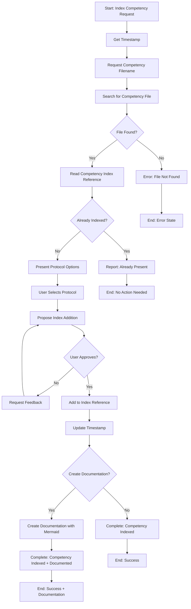
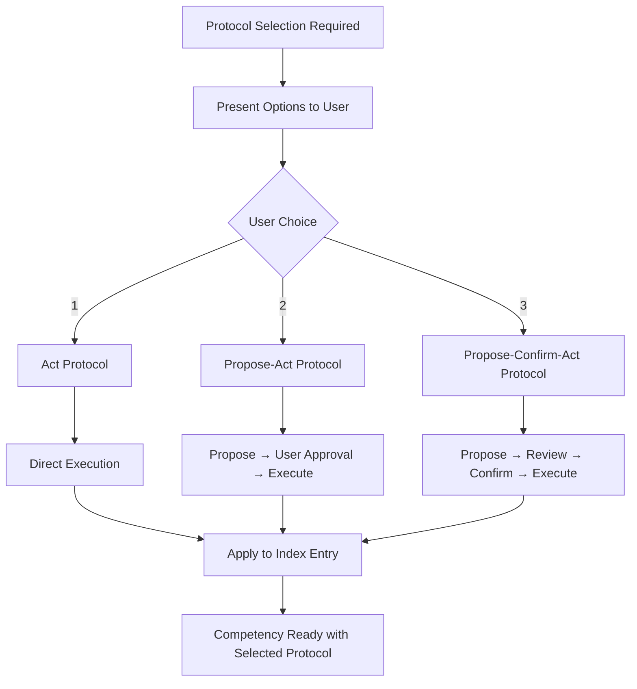
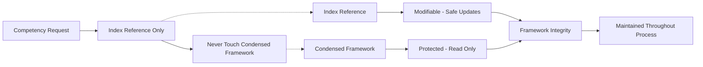

# Index Competency Management

**Created**: 20251016-0617  
**Competency**: `olaf-kernel/index-competency.md`  
**Protocol**: Propose-Act

## Overview

The Index Competency Management system ensures that OLAF framework competencies are properly registered and available for use. This competency automates the process of discovering, validating, and indexing new competencies while maintaining framework integrity.

## Purpose and Functionality

### Core Functions

1. **Competency Discovery**: Locates competency prompt files within the OLAF framework structure
2. **Index Verification**: Checks if competencies are already registered in the competency index
3. **Protocol Selection**: Allows users to choose appropriate interaction protocols for competencies
4. **Safe Index Updates**: Modifies only the competency index reference, never the condensed framework
5. **Documentation Generation**: Creates comprehensive documentation with workflow diagrams
6. **Framework Integrity**: Maintains OLAF structure and patterns throughout the process

### Key Benefits

- **Automated Registration**: Streamlines competency integration into the framework
- **Protocol Flexibility**: Supports Act, Propose-Act, and Propose-Confirm-Act protocols
- **Safety First**: Prevents direct modification of critical framework files
- **Documentation Support**: Generates comprehensive documentation with visual workflows
- **Team Collaboration**: Integrates with PR workflow for branch management

## Workflow Diagrams

### Main Competency Indexing Flow



### Protocol Selection Decision Tree



### Framework Safety Model



## Usage Examples

### Basic Competency Indexing

```bash
# User request
"index competency"

# System response
"What competency prompt filename should I index?"

# User provides filename
"clean-srt-file.md"

# System locates, checks, and proposes addition with protocol selection
```

### Self-Indexing Example

```bash
# Competency indexes itself
"use index competency to index itself"

# System automatically:
# 1. Locates index-competency.md
# 2. Checks index (not found)
# 3. Offers protocol selection
# 4. Adds with user-selected protocol
# 5. Offers documentation creation
```

## Integration Patterns

### OLAF Framework Integration

- **Competency Index Reference**: Primary integration point for new competencies
- **Condensed Framework**: Protected from direct modification
- **Protocol Inheritance**: New competencies inherit selected interaction protocols
- **Documentation Linking**: Generated docs reference competency files and workflows

### Development Workflow Integration

1. **Create Competency**: Develop new competency prompt file
2. **Index Competency**: Use this system to register it
3. **Test Integration**: Verify competency works with selected protocol
4. **Create PR**: Use framework PR features for team collaboration
5. **Merge**: Integrate into main framework branch

## Protocol Selection Rationale

### Act Protocol
- **Use Case**: Simple, low-risk competencies
- **Characteristics**: Direct execution without user confirmation
- **Examples**: File reading, status checks, information retrieval

### Propose-Act Protocol
- **Use Case**: Medium-risk competencies with user impact
- **Characteristics**: Propose action, get approval, then execute
- **Examples**: File modifications, index updates, content generation

### Propose-Confirm-Act Protocol
- **Use Case**: High-risk competencies with significant impact
- **Characteristics**: Propose, review, confirm, then execute
- **Examples**: System changes, bulk operations, critical updates

## Technical Implementation

### File Structure Impact

```
olaf-core/
├── reference/
│   └── query-competency-index.md    # Modified by this competency
├── prompts/
│   └── olaf-kernel/
│       └── index-competency.md      # This competency file
└── .condensed/
    └── olaf-framework-condensed.md  # Protected - never modified
```

### Index Entry Format

```javascript
[
  ["trigger1", "trigger2", "trigger3"],  // User input patterns
  "category/competency-file.md",         // Prompt file path
  "Protocol-Name"                        // Interaction protocol
]
```

## Maintenance and Updates

### Adding New Trigger Patterns

To add new trigger patterns for the index-competency:

1. Locate the entry in `query-competency-index.md`
2. Add new patterns to the triggers array
3. Update the timestamp
4. Test with new patterns

### Updating Documentation

This documentation should be updated when:
- New features are added to the competency
- Workflow changes are implemented
- Integration patterns evolve
- User feedback suggests improvements

## Best Practices

### For Framework Maintainers

1. **Always use this competency** to register new competencies
2. **Test protocol selection** with different competency types
3. **Generate documentation** for complex competencies
4. **Use PR workflow** for team collaboration
5. **Maintain index organization** and formatting

### For Competency Developers

1. **Follow naming conventions** for competency files
2. **Include proper metadata** in competency headers
3. **Test competency functionality** before indexing
4. **Choose appropriate protocols** based on risk assessment
5. **Document complex workflows** with mermaid diagrams

## Troubleshooting

### Common Issues

**Competency File Not Found**
- Verify file exists in `olaf-core/prompts/` structure
- Check filename spelling and extension
- Ensure proper directory structure

**Index Format Errors**
- Maintain existing pattern format
- Preserve array structure and commas
- Update timestamp after changes

**Protocol Selection Issues**
- Use numbered options (1, 2, 3)
- Understand protocol implications
- Test with selected protocol

### Recovery Procedures

If index becomes corrupted:
1. Restore from git history
2. Manually verify all entries
3. Update timestamp
4. Test competency loading

## Future Enhancements

### Planned Features

- **Automated Testing**: Validate competency functionality during indexing
- **Bulk Operations**: Index multiple competencies simultaneously  
- **Version Management**: Track competency versions and updates
- **Dependency Mapping**: Identify competency relationships and dependencies
- **Performance Metrics**: Monitor competency usage and performance

### Integration Opportunities

- **CI/CD Pipeline**: Automated competency validation and indexing
- **Documentation Generation**: Automated doc updates from competency changes
- **Quality Assurance**: Automated testing and validation workflows
- **Team Collaboration**: Enhanced PR and review processes

---

**Note**: This documentation is automatically generated and should be updated when the competency evolves or new features are added.